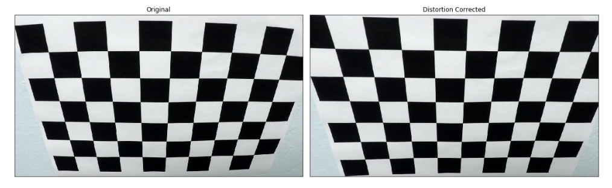
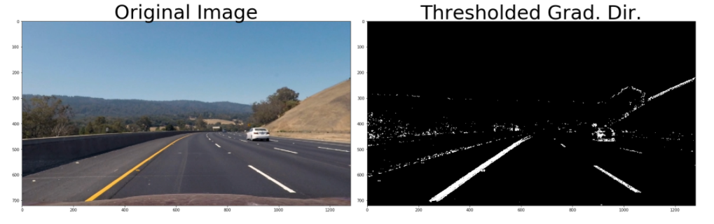
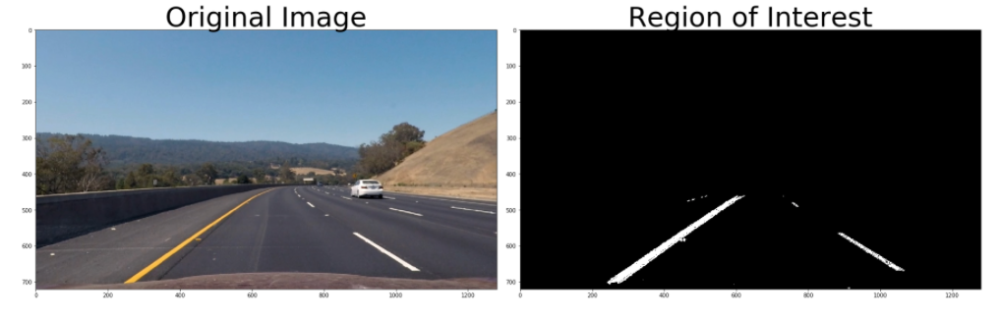
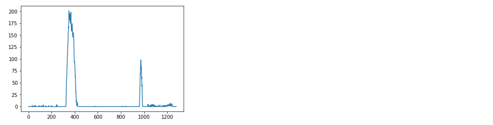
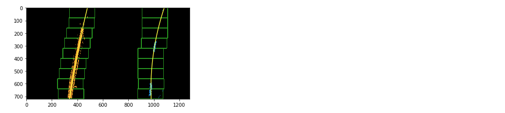
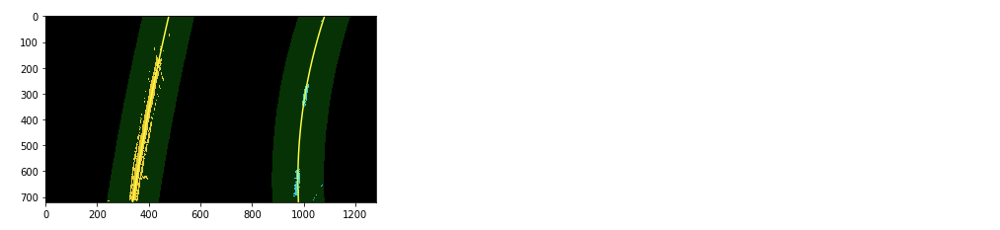

# advanced-lane-lines-p4

**Advanced Lane Finding Project**

The goals / steps of this project are the following:

* Compute the camera calibration matrix and distortion coefficients given a set of chessboard images.
* Apply a distortion correction to raw images.
* Use color transforms, gradients, etc., to create a thresholded binary image.
* Apply a perspective transform to rectify binary image ("birds-eye view").
* Detect lane pixels and fit to find the lane boundary.
* Determine the curvature of the lane and vehicle position with respect to center.
* Warp the detected lane boundaries back onto the original image.
* Output visual display of the lane boundaries and numerical estimation of lane curvature and vehicle position.

## [Rubric](https://review.udacity.com/#!/rubrics/571/view) Points

### Here I will consider the rubric points individually and describe how I addressed each point in my implementation.  

---

### Writeup / README

#### 1. Provide a Writeup / README that includes all the rubric points and how you addressed each one.  You can submit your writeup as markdown or pdf.  [Here](https://github.com/udacity/CarND-Advanced-Lane-Lines/blob/master/writeup_template.md) is a template writeup for this project you can use as a guide and a starting point.  

You're reading it!

### Camera Calibration

#### 1. Briefly state how you computed the camera matrix and distortion coefficients. Provide an example of a distortion corrected calibration image.

The code for this step is contained in the IPython notebook  "./carnd_adv_lane_lines_p4.ipynb" in the first code cell entitled "Camera Calibration: Find object points and image points".

I start by preparing "object points", which will be the (x, y, z) coordinates of the chessboard corners in the world. Here I am assuming the chessboard is fixed on the (x, y) plane at z=0, such that the object points are the same for each calibration image.  Thus, `objp` is just a replicated array of coordinates, and `objpoints` will be appended with a copy of it every time I successfully detect all chessboard corners in a test image.  `imgpoints` will be appended with the (x, y) pixel position of each of the corners in the image plane with each successful chessboard detection.  

I then used the output `objpoints` and `imgpoints` to compute the camera calibration and distortion coefficients using the `cv2.calibrateCamera()` function in the cell entitled "Camera Calibration: compute matrix and distortion coefficients".  I applied this distortion correction to the test image using the `cv2.undistort()` function and obtained this result:



### Pipeline (single images)

#### 1. Provide an example of a distortion-corrected image.

To demonstrate this step, I will describe how I apply the distortion correction to test images in the cell entitled "Distortion-Corrected Image":

I first read the images using OpenCV and converted from BGR color to RGB. As above, I used `cv2.undistort()` to undistort the image, using the camera calibration matrix and distortion parameters computed from the chessboard test images.

![Test Image][./output_images/test_images_distortion_corrected.jpg]

#### 2. Describe how (and identify where in your code) you used color transforms, gradients or other methods to create a thresholded binary image.  Provide an example of a binary image result.

I used a combination of color and gradient thresholds to generate a binary image (thresholding steps at lines # through # in `another_file.py`).

First, I converted from RGB color to HLS and isolated the S channel to capture pixels corresponding to color saturation. Then, I created a binary matrix consisting of the value of "1" wherever the saturation layer was between the threshold values of 170 and 255.

Then, I calculated the Sobel gradients in the x and y directions to apply threshold values for gradient direction and magnitude to create two more binary matrixes having "1" values where the gradients met the thresholds.

Finally, the three binary matrixes were combined to produce a resulting thresholded binary image like this:



In addition, I applied a region of interest using the function `region_of_interest()` in the cell entitled "Region of Interest." This masked the pixels outside of my identified polygon and produced this image:



#### 3. Describe how (and identify where in your code) you performed a perspective transform and provide an example of a transformed image.

The code for my perspective transform includes a function called `get_transforms()` and a function called `warper()`, which appear in the cell entitled "Perspective Transform".  The `get_transforms()` function takes as inputs the source (`src`) and destination (`dst`) points and returns the transformation matrix and its inverse. The function `warper()` applies the transformation matrix to an image and returns the transformed image.

In the cell entitled "Perspective Transform: Select Source Points and Destination Points" I chose to hardcode the source and destination points in the following manner:

```python
src = np.float32(
    [[(img_size[0] / 2) - 62, img_size[1] / 2 + 100],
    [((img_size[0] / 6) - 10), img_size[1]],
    [(img_size[0] * 5 / 6) + 60, img_size[1]],
    [(img_size[0] / 2 + 68), img_size[1] / 2 + 100]])
dst = np.float32(
    [[(img_size[0] / 4), 0],
    [(img_size[0] / 4), img_size[1]],
    [(img_size[0] * 3 / 4), img_size[1]],
    [(img_size[0] * 3 / 4), 0]])
```

This resulted in the following source and destination points:

Source points
[[  578.           460.        ]
 [  203.33332825   720.        ]
 [ 1126.66662598   720.        ]
 [  708.           460.        ]]
Destination points
[[ 320.    0.]
 [ 320.  720.]
 [ 960.  720.]
 [ 960.    0.]]

I verified that my perspective transform was working as expected on a straight lane image by drawing the `src` and `dst` points onto a test image and its warped counterpart to verify that the lines appear parallel in the warped image. Then, I warped a curved lane image as well:

![Warped Images][./output_images/test_images_warped.png]

#### 4. Describe how (and identify where in your code) you identified lane-line pixels and fit their positions with a polynomial?

To identify lane lines I used two functions, one to identify the lines in the first frame and after losing the path of the lines, and another to expand the lines after they are found.

To find lines, I started with a histogram of the x coordinate values in the thresholded binary pixels, as illustrated in the cell entitled "Identifying Lane Lines: Basic Histogram of Warped Image":



I use such a histogram in the `find_lane_lines()` function in the cell entitled "Identifying Lane Lines: Find Lane Pixels with Sliding Windows." This function starts searching for lane lines at the x coordinates that have the most pixels as indicated in the histogram. It uses sliding windows along the x direction to find the greatest number of pixels and, when they are found, performs the same process in the next level up in the image, until the entire set of right and left line pixels are found.

These pixels are used in a call to `np.polyfit` to fit a line to the pixels and represent the line found in the image.

Alternatively, for the next set of images, the function `extend_lane_lines()` is used to reduce the search area by using the fitted lines from previous calls to limit the search for the next line pixels. This function is located in the cell entitled "Identifying Lane Lines: Find Lane Pixels Using Previous Pixel Positions" and uses a similar call to `np.polyfit` using the identified pixels.

After identifying the lane lines, they are smoothed by saving the current polynomial fit coefficients and averaging them over 16 frames before drawing them onto the road image. This is accomplished using a collections.deque data structure and appending new elements to the left and allowing the oldest elements to be dropped off when the 16 cells are filled.

```python
# Define a class to receive the characteristics of each line detection
class Line():
    def __init__(self):
        # was the line detected in the last iteration?
        self.detected = False  
        #polynomial coefficients averaged over the last n iterations
        self.best_fit = None  
        #polynomial coefficients for the most recent fit
        self.current_fit = collections.deque([], 16)  
        #radius of curvature of the line in some units
        self.radius_of_curvature = None
```

#### 5. Describe how (and identify where in your code) you calculated the radius of curvature of the lane and the position of the vehicle with respect to center.

Radius of curvature is calculated in two steps.

First, the ROC for each line is calculated in each of the functions `find_lane_lines()` and `extend_lane_lines()` by fitting lines to the x and y coordinates of pixels multiplied by a factor representing the number of pixels per meter. Then, the resulting coefficients of these lines are used in this code to arrive the the ROC for the left and right lines:

```python
left_curverad = ((1 + (2*left_fit_cr[0]*y_eval*ym_per_pix + left_fit_cr[1])**2)**1.5) / np.absolute(2*left_fit_cr[0])
right_curverad = ((1 + (2*right_fit_cr[0]*y_eval*ym_per_pix + right_fit_cr[1])**2)**1.5) / np.absolute(2*right_fit_cr[0])
```
Then, this calculation uses the two ROC values to arrive at a single value for the center of the lane:

```python
center_curverad = np.mean( np.array([left_curverad, right_curverad]), axis=0 )
```

#### 6. Provide an example image of your result plotted back down onto the road such that the lane area is identified clearly.

Here is an example of the result on a test image from `find_lane_lines()` in the cell "Identifying Lane Lines: Find Lane Pixels with Sliding Windows":



Here is an example of the result on a test image from `extend_lane_lines()` in the cell "Identifying Lane Lines: Find Lane Pixels Using Previous Pixel Positions":



---

### Pipeline (video)

#### 1. Provide a link to your final video output.  Your pipeline should perform reasonably well on the entire project video (wobbly lines are ok but no catastrophic failures that would cause the car to drive off the road!).

Here's a [link to my video result](./project_video_output.mp4)

---

### Discussion

#### 1. Briefly discuss any problems / issues you faced in your implementation of this project.  Where will your pipeline likely fail?  What could you do to make it more robust?

My final pipeline did a fine job of identifying lines in the basic project video, even through areas of changing lighting and shadow.

However, there are at least a couple of areas for improvement in further work:

* The pipeline switches from `extend_lane_lines()` back to the more extensive search in `find_lane_lines()` when the lane width exceeds a threshold; better criteria can be applied to identify whether to restart the search, such as using a minimum number of found pixels

* There is quite a bit of duplicated code in the functions `find_lane_lines()` and `extend_lane_lines()` and so they are ripe for code refactoring
